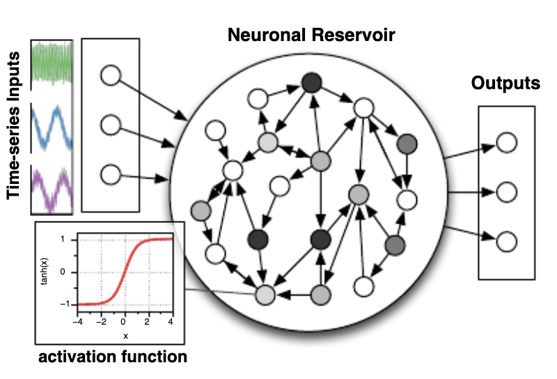
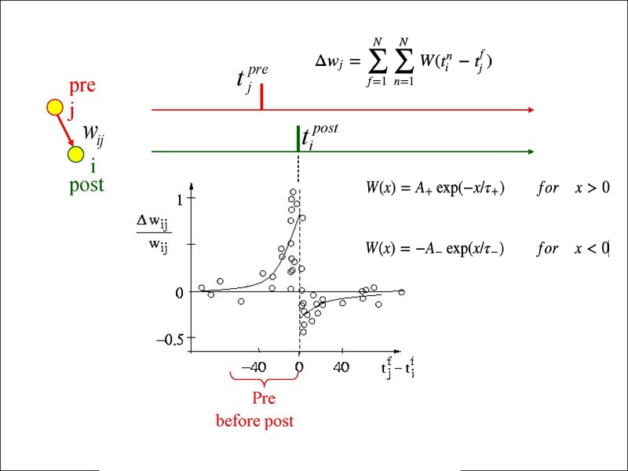
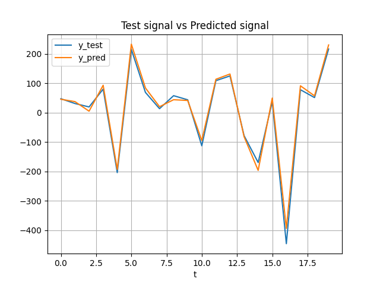
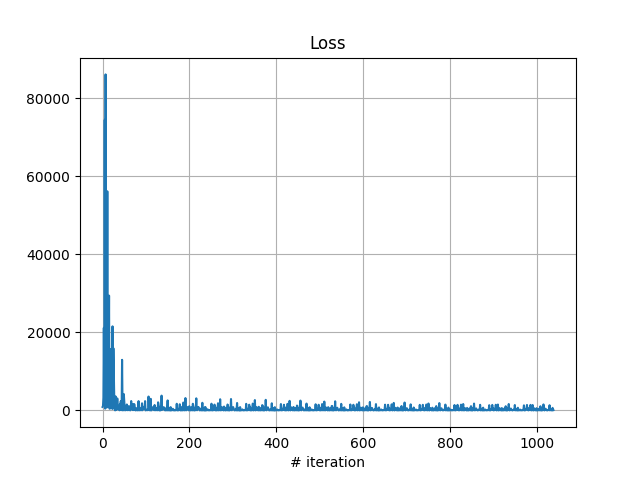

- [INTRODUCTION](#introduction)
- [METHODS](#methods)
  - [Echo State Network](#echo-state-network)
  - [Spike-Timing Dependent Plasticity](#spike-timing-dependent-plasticity)
  - [Training](#training)
- [Results](#results)
- [References](#references)

## INTRODUCTION

Neuromorphing computing is an emerging field that aims to develop computer systems inspired by the human brain. Echo State Networks (ESNs) are a class of recurrent neural networks used successfully in signal processing applications. In this poster, we explore the use of learning with STDP (Spike-Timing Dependent Plasticity) within the reservoir of an ESN as a potential optimisation candidate for neuromorphing computing.​

## METHODS

### Echo State Network
The ESN architecture typically consists of 3 layers: Input, Reservoir and Readout.
The Reservoir is a layer in which all neurons are considered to be connected to each other, and whose synaptic weights are not trainable.
The Readout is a Linear layer connected to all neurons in the Reservoir and is the only one subject to training.

Passing the input through the network is done by a recursive step-by-step reading of the input, in which as the individual step slices of the input are submitted to the Reservoir, the units of the Reservoir will restart at each step with the state of the previous step.

In our study, an ESN was implemented in Pytorch, whose Reservoir is made up of 100 units and the Readout of 1, while the Input layer was used in various sizes, to test the performance of the network. Reservoir weights were initialised with a spectral radius of 0.9.
The activation function used during a neural network execution step is a *tanh*.

[SOH, 2014]

### Spike-Timing Dependent Plasticity
STDP (Spike-Timing Dependent Plasticity) is a learning rule that governs the synaptic plasticity in neural networks. It allows neural networks to continually update their connections and adapt to changes in the environment or input statistics, enhancing their flexibility and ability to learn and respond to new information.
Basically it states that the strength of a synapse between two neurons is modified based on the precise timing of their spiking activity. Specifically, if the presynaptic neuron
if the presynaptic neuron fires before the postsynaptic one, the synapse strengthens, otherwise the opposite happens.

[SJÖSTRÖM, 2010]

### Training
The experiment was conducted on a supervised learning regression task, where a multidimensional time series was provided as input, and the objective was to predict a unidimensional time series as output. The dataset was generated algorithmically using scikit-learn.  
A train/test split of 20% is then applied.
The entire dataset is shown to the network several times (epochs) and at certain intervals of epochs, the STDP acts on the reservoir.
A logic was implemented for recording the reservoir activations, decoupled from the network implementation itself. During training, these activations are thresholded, with threshold equal to 0, and accumulated in a variable that will then contain the *traces* of the spikes.
A function takes care of taking these traces, applying the optimised version of the STDP and returning the new weight matrix of the Reservoir, which will finally be assigned to it.
An optimisation based on SGD (Stochastic Gradient Descent) acts on the Readout, and the error is calculated according to MSE (Mean Squared Error).

## Results
Our study shows that using STDP in the reservoir of an ESN can lead to consistent and effective training, as shown in the pictures below.  

\[\@GIAN: TO FURTHER ELABORATE\]
  

## Conclusions

## References
1. BI, Guo-qiang; POO, Mu-ming. Synaptic modification by correlated activity: Hebb's postulate revisited. Annual review of neuroscience, 2001, 24.1: 139-166.
2. SJÖSTRÖM, Jesper, et al. Spike-timing dependent plasticity. Spike-timing dependent plasticity, 2010, 35.0: 0-0.
3. YUSOFF, Mohd-Hanif; JIN, Yaochu. Modeling neural plasticity in echo state networks for time series prediction. In: 2014 14th UK Workshop on Computational Intelligence (UKCI). IEEE, 2014. p. 1-7.
4. SOH, Harold; DEMIRIS, Yiannis. Spatio-temporal learning with the online finite and infinite echo-state Gaussian processes. IEEE transactions on neural networks and learning systems, 2014, 26.3: 522-536.