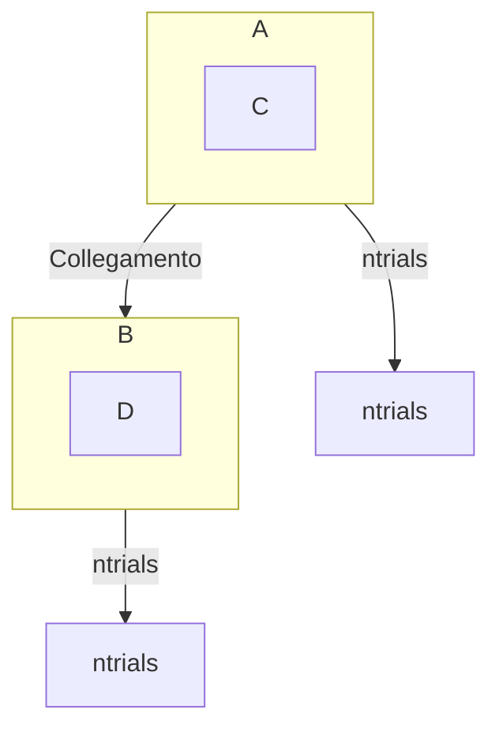
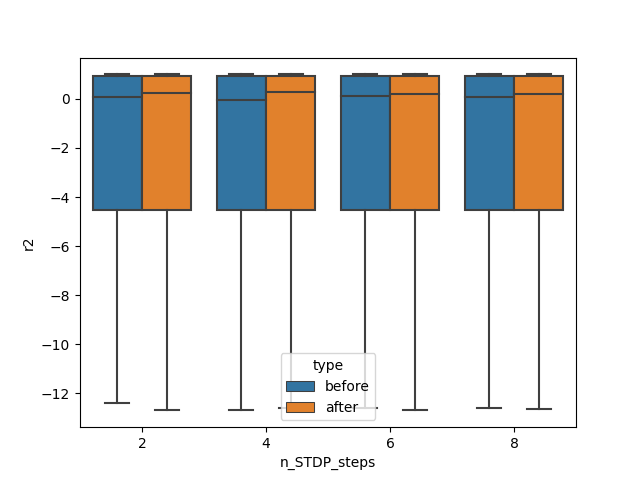
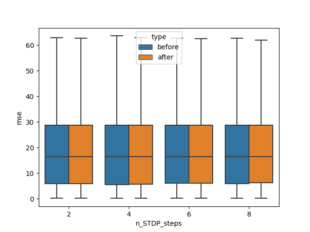
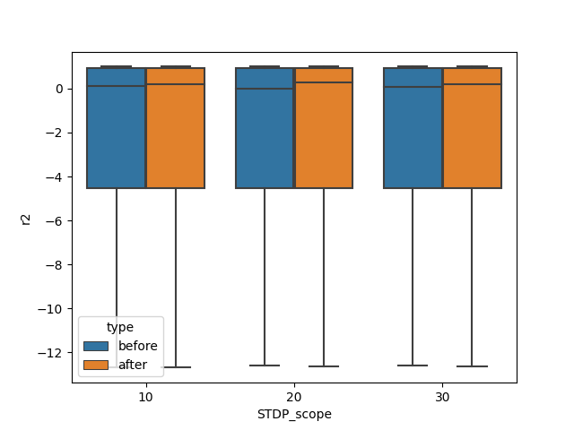
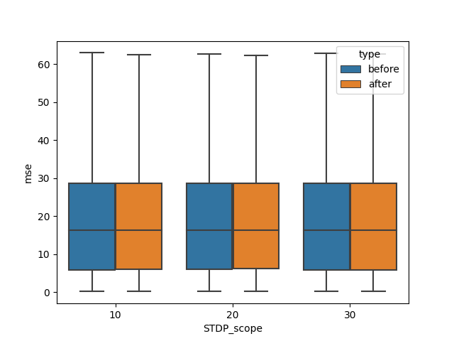
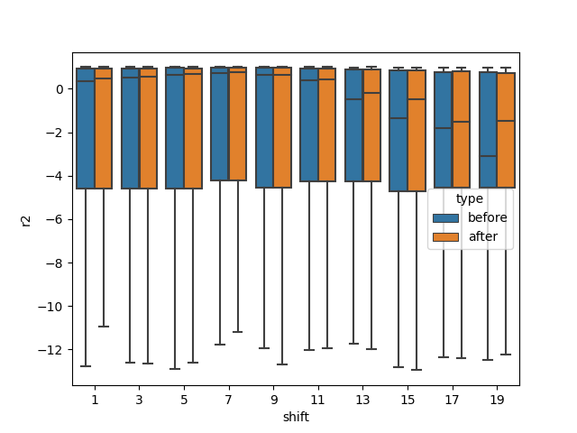
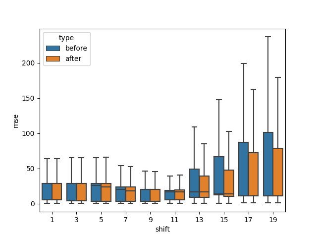
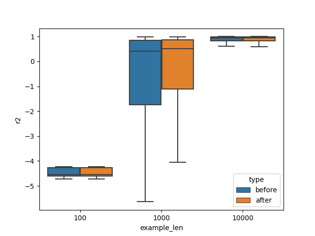
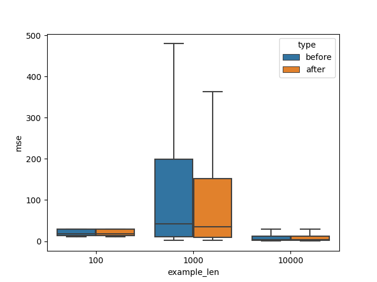

# Forecast of Lorenz signal with ESN \[Sketch\]

- [Framing the problem](#framing-the-problem)
  - [Research Questions](#research-questions)
- [The experimental protocol](#the-experimental-protocol)
  - [Data Generation](#data-generation)
  - [The model definition](#the-model-definition)
  - [The experiment](#the-experiment)
    - [Classical ESN training.](#classical-esn-training)
    - [Optimisation of Reservoir weights](#optimisation-of-reservoir-weights)
  - [Scheme](#scheme)
- [Evaluation](#evaluation)
- [References](#references)
- [Results](#results)
  - [Notes](#notes)
  - [TODO](#todo)
  - [RQ](#rq)

## Framing the problem

The problem is framed as forecasting a chaotic signal.

### Research Questions

In this paper, the following research questions were formulated:

1. RQ1: Can a simplified STDP mechanism be used as a weight optimiser in a second-generation network?
2. RQ2: Do any situations exist in which such an optimisation mechanism brings about performance improvements?

## The experimental protocol

### Data Generation

Data is generated through a specific function that defines the typical Lorenz system.
Subsequently, the generated dataset is divided into examples and labels, applying a specific *shift* to the labels with respect to the examples, depending on the experiment.
The dataset is then further divided into *training*, *validation* and *test* set.

### The model definition

A Echo State Network (ESN) is defined, with the following parameters: the input size will be equal to the size of a generated Lorenz example; the same applies to the output size and labels; while the Reservoir size remains a free parameter, to be specified according to the experiment specifications.

### The experiment

Several classical training trials of an NGE were carried out, with subsequent re-training following optimisation of the initial weights.
All this was carried out as certain parameters changed, according to the following grid.  
| parameter | values |
|-|-
|`example_len` | 100, 1000, 10000|
|`shift`| 1, 3, 5, 7, 9, 11, 13, 15, 17, 19|
|`n_STDP_steps`| 2, 4, 6, 8|
|`STDP_scope`| 10, 20, 30|

Where `example_len` is the length of a single example, which in fact corresponds to the entire signal being passed to the network as input. `shift` is the delay of the label signal (output) with respect to to the input signal.
`n_STDP_steps` is the number of STDP application cycles. 
`STDP_scope` is the time interval considered for applying STDP, outside of which spikes are not considered. See [Optimisation of Reservoir weights](#optimisation-of-reservoir-weights) for more details.

Each run of the trials follows two main phases: one of classical ESN training, and a second in which the Reservoir weights are optimised using the simplified STDP.

Let us take an example. We will conduct `n_trials` trials, with `n_trials` being an integer greater than zero. For each trial you will have:

1. classical ESN training
2. optimisation of Reservoir weights with simplified STDP

In total, around 360 experiments were therefore carried out, each consisting of 50 trials.

#### Classical ESN training.

The ESN was trained according to the solution discussed in  [4.4 Direct Pseudoinverse Solution, LUKOŠEVIČIUS et al., 2012](#references).

$$W^{out}=Y^{target}X^+$$
With $W_{out}$ are the output weights, namely the optimal Reservoir weights; $Y^{target}$ is the output signal, or *label* for the supervised ML problem; $X^+$ is the Moore-Penrose pseudoinverse of $X$.

#### Optimisation of Reservoir weights

Since the Reservoir weights are fixed, once initialised, the optimisation of the Reservoir will correspond to an amount of STDP steps during initialisation. By doing so, one expects to find a configuration that amplifies performance with respect to the task.

The ESN goes into this phase immediately after being trained and evaluated in the first phase (classical training). This will later allow performance to be compared, since the dataset will be the same.

The main parameters in this phase are:

- the number of STDP steps, `n_STDP_steps`;
- the maximum number of steps within which to apply the spike collection, `STDP_scope`;
- the threshold for spike identification, `th`.

The following steps are addressed during optimisation:

1. Raster creation. The activations of all the Reservoir units, of the last `STDP_scope` steps, are thresholded, obtaining a binary matrix of events.
2. STDP step. A simplified STDP step is applied, to obtain the new weights.
3. The new weights are normalised and centred on zero.
4. Every second STDP step the weights are attenuated and some noise is added to them.
5. The ESN is trained with these optimised Reservoir weights.
6. Finally, the ESN is evaluated.

### Scheme

## Evaluation

In order to evaluate the performance of the model, the following metrics, implemented in scikit-learn, were adopted in cross validation.

* [mean_absolute_error](https://scikit-learn.org/stable/modules/generated/sklearn.metrics.mean_absolute_error.html#sklearn.metrics.mean_absolute_error). The lower the better.
* [mean_squared_error](https://scikit-learn.org/stable/modules/generated/sklearn.metrics.mean_squared_error.html). The lower the better.
* [r2_score](https://scikit-learn.org/stable/modules/generated/sklearn.metrics.r2_score.html) (coefficient of determination, $R^2$ ). The higher the better. It is a computationally robust version, for which perfect predictions score 1 and imperfect predictions score 0.  
$$

R^2(y, \hat{y})=1-\frac{ \sum^{n}_{i=1} (y_i - \hat{y_i})^2}{\sum^{n}_{i=1} (y_i - \bar{y_i})^2}
$$

## References

1. https://scikit-learn.org
2. [LUKOŠEVIČIUS, Mantas. A practical guide to applying echo state networks.
     Neural Networks: Tricks of the Trade: Second Edition, 2012, 659-686.](https://www.ai.rug.nl/minds/uploads/PracticalESN.pdf)

## Results

Below are summary plots of the results obtained across all experiments, according to parameter variance.
For convenience, MSE and R2 have been reported as performance metrics, but it would be expected that both would be consistent in behaviour.

The results are summarised here.  
Performance shows a slight improvement after the application of STDP, appreciable

- as the number of STDP steps increases (mainly supported by r2); 
- as the STDP scope increases (again mainly supported by r2).

Performance shows a more marked improvement after the application of STDP, appreciable as shift and example_len increase. Evidently, applying the STDP, an initial configuration of Reservoir weights more appropriate for the task is obtained.

 
 

 
   

   
 

 
  

### Notes

### TODO

- [v] track eigenvalues during STDP
- [v] visualize evolution vs weights/eigenvalues
- [v] visualize
  - shift vs forecast
  - shift vs performance

### RQ

1. Does the STDP amplifies performance for constrained Reservoirs (vs Resv size)?
2. How about different STDP?
3. Spiking:
    1. what's the relationship between plasticity and encoding?
    2. performance vs neuron type

tanh(
    {
        tanh(sum(w * input_a) + 
    } + tanh(sum(w * input_b) ...
)