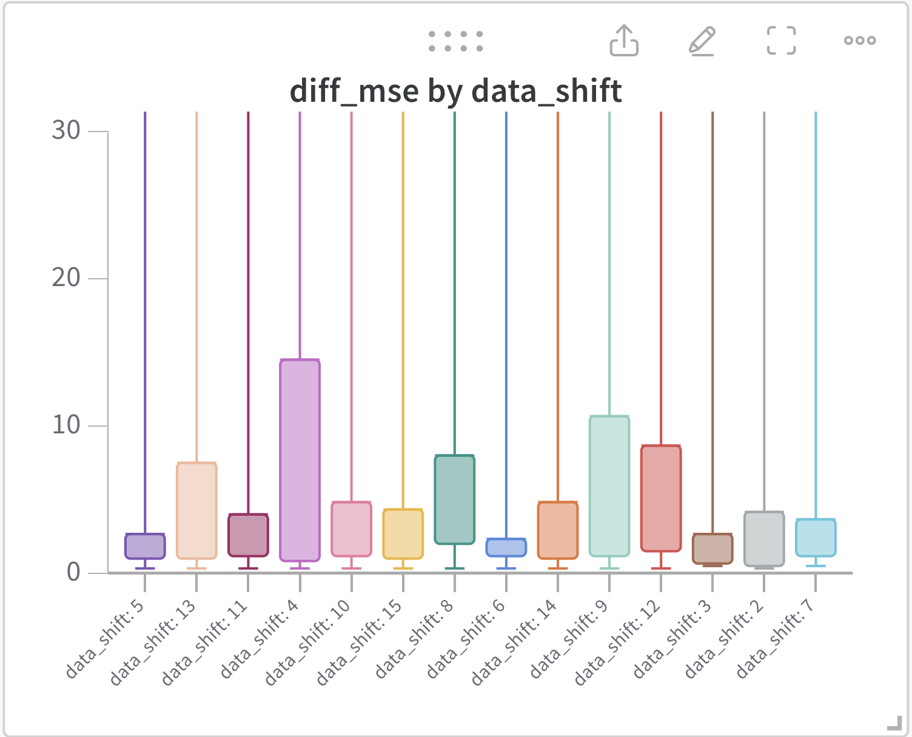
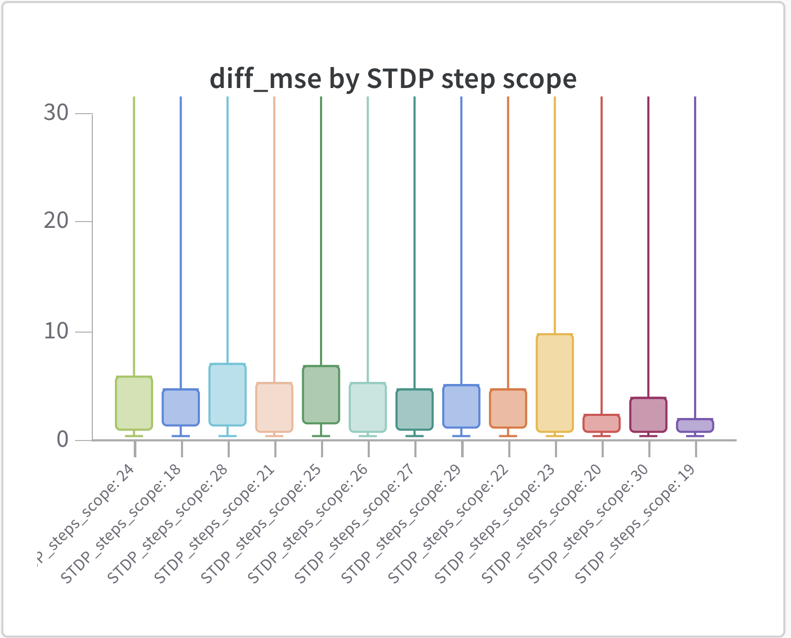
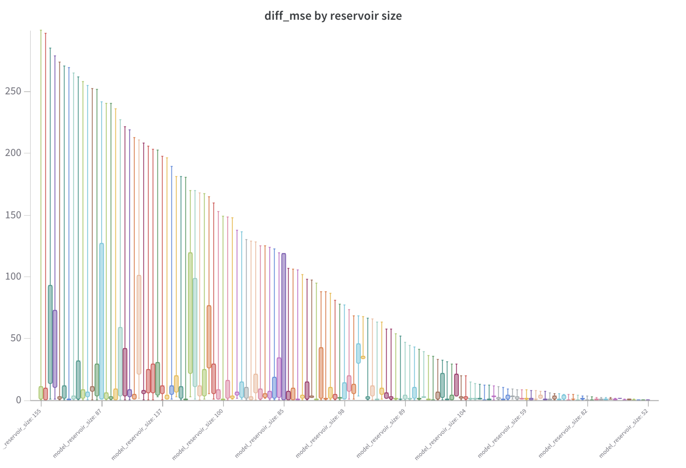

# Parameter Optimisation

- [Parameters](#parameters)
  - [Results](#results)
    - [Notation](#notation)
    - [Plots](#plots)
- [References](#references)

A research experiment of hyperparameters was carried out. The goal is to understand under what conditions the algorithm can perform better or worse.
The *wandb* (Weight and Biases)\[BIEWALD, 2020\] service was used for this purpose.
An experiment of 6147 total runs was performed.

## Parameters

The settings used for optimization follow.

```yaml
method: random

metric:
  goal: minimize
  name: loss_val

parameters:
  data_example_len:
    distribution: int_uniform
    min: 100
    max: 10000
  data_test_size:
    value: 0.2
  data_valid_size:
    value: 0.15
  data_shift:
    distribution: int_uniform
    min: 1
    max: 15

  model_reservoir_size:
    distribution: int_uniform
    min: 20
    max: 200
  model_decay:
    distribution: uniform
    min: 0
    max: 1

  # STDP_steps_scope: (int). Last steps to consider for STDP spike collection
  STDP_steps_scope:
    distribution: int_uniform
    min: 10
    max: 50
  STDP_A_minus:
    distribution: uniform
    min: .1
    max: .5
  STDP_A_plus:
    distribution: uniform
    min: .1
    max: .5
  STDP_tau_plus:
    distribution: uniform
    min: 1.e-3
    max: 1
  STDP_tau_minus:
    distribution: uniform
    min: 1.e-3
    max: 1


  # Here we measure the performance distribution of many trials, since
  # the randomicity of the initialization may alter the performance.

  # n_trials: (int).
  exp_n_trials:
    values: [5]
  # n_STDP_steps: (int). How many times apply the STDP per each time step
  exp_n_STDP_steps:
    values: [5]

```

### Results

#### Notation

- `diff_mse` : The difference in $MSE$ between the case in which STDP was not applied and after it was applied. The more positive it is the more effective is the STDP algorithm.
$$
\text{diff\_mse}: \Delta MSE = MSE_{NoSTDP} - MSE_{STDP}
$$

- `data_shift`: The lag of labels $Y$ compared with examples $X$, in the forecast experiment.
- `STDP_steps_scope`: Number of steps along which to apply STDP.

#### Plots



The graph above has been restricted to maximum 30. This was to discard individual cases where the order of magnitude extended up to 4 orders of magnitude, which were considered to be outliers. It can be seen that diff_mse is always positive. No obvious patterns showing linear relationships between the variables considered can be seen. It can be seen that:

- for data_shift up to 3, the box of diff_mse starts approximately from zero, indicating a minor improvement.
- For data_shifts of 8, 9, 12, the diff_mse box starts from at least 29, indicating greater improvement. The smaller size of the data_shift box equal to 8 indicates that the algorithm performed better and with more confidence in this situation.



The same aconsiderations made for the previous graph apply to this one above.
In particular, we can observe that

- STDP_steps_scope equal to 18, 24, 25, 28 the diff_mse box starts from at least 33, indicating greater improvements. The smaller size of the data_shift box, for STDP_steps_scope equal to 18 indicates that the algorithm performed better and with more confidence in this situation.




## References

1. [BIEWALD, Lukas. Experiment tracking with weights and biases. Software available from wandb. com. 2020. URL https://www.wandb.com, 2020.](https://wandb.ai/site/research?_gl=1*1g75h20*_ga*MTYxNzc5Njk0Ni4xNzAwMTIwMDI1*_ga_JH1SJHJQXJ*MTcwNDk1NDQzMS4yOS4xLjE3MDQ5NTYwMjMuNS4wLjA.#cite-weights-and-biases:~:text=How%20to%20cite%20Weights%20%26%20Biases)