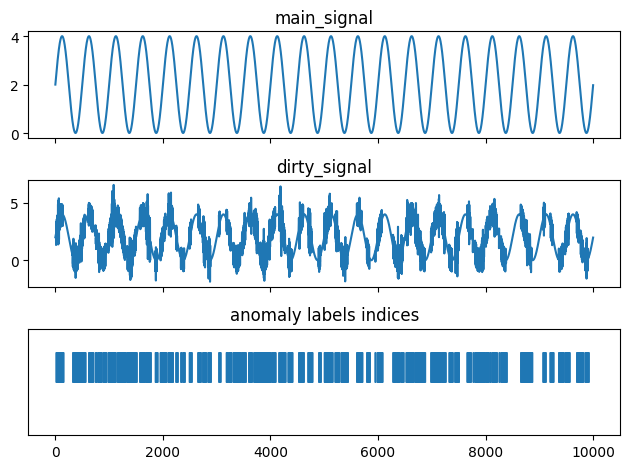

# LSTM Anomaly Detector

Referred to: [flows/01-LSTM-AnomDetect.py](flows/01-LSTM-AnomDetect.py)

Contents
- [Problem framing](#problem-framing)
- [The Dataset](#the-dataset)
- [Data Preparation](#data-preparation)
  - [Train test validation split](#train-test-validation-split)
- [The Estimator](#the-estimator)
- [Training](#training)
- [Evaluation](#evaluation)

## Problem framing

Simple detector based on LSTM.
X is a collection of windowed signal shifts.

Given

- signal, s: $s = {s_1, ..., s_n}$
- time window, $w \in \mathbb{N}$.

We define

- examples, $X: X = \{s[t-w, t], s[t+1-w, t+1], ..., s[t+n-w, n]\}$
- labels, y: $y = \{y_1, ..., y_n\} = y_i \in \{0, 1\}$, with $i \in \{1, n\}$

## The Dataset

The signal is generated defining a sinusoidal signal and adding anomalies to it. Anomalies are random alterations of frequency in certain random intervals.

## Data Preparation

$w = 10$

An example of shifted signals from the examples is shown in the next image.  In this example, 8 signals were taken, not consecutively, but every third signal, so as to show more clearly the shift between one signal and the next one.

    
    

  
### Train test validation split

...

## The Estimator
 
The estimator is very simple. It is made by a `LSTM` layer followed by a `Linear` with `Tanh` activation.

The `LSTM` layer is used to capture time-dependent behaviour, while the Tanh binarises the results.

## Training

The training took place by employing:

- Binary Cross Entropy Loss ([`nn.BCEWithLogitsLoss()`](https://pytorch.org/docs/stable/generated/torch.nn.BCEWithLogitsLoss.html)) as loss criterion;
- Adam as optimizer

A detail of the $x_i$ signal and an associated prediction $y_i$, used during training, can be seen below.

## Evaluation

In the following figure we see:
on the left the training loss and on the right the F1 score on the validation set. The latest F1-score is about 0.96.

Below we can observe a comparison graph between the test signal and the predictions.
In the first graph we can observe the signal, recolored orange at the indices predicted as anomalies, superimposed on the test signal.

The second graph shows the indices predicted as anomalies.

