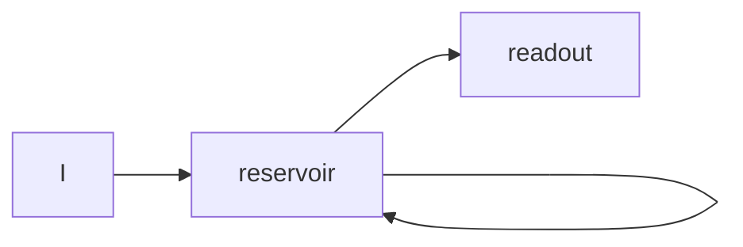
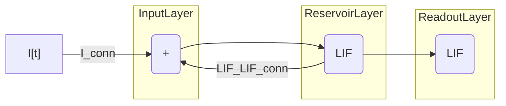

# Tutorial

## Contents

- [Contents](#contents)
- [Sketch of the network](#sketch-of-the-network)
- [Basics](#basics)


1. [Neuron](./tutorials/_1_neuron.py)
2. [Neuron pair, same input](./tutorials/_2_neuron_pair.py)
3. [Neuron pair, different input](./tutorials/_3_neuron_pair_difnt_input.py)
4. [Connected neuron pair](./tutorials/_4_neuron_pair_connected.py)


## Sketch of the network





## Basics


```python
torch.matmul(A, B)
# := <A, B>
```

First, let us see how we can reproduce the behavior of a neuron
that receives a constant input.

```python
# Neuron definition
lif1 =snn.Lapicque(
    R=5.1, C=0.005, time_step=1e-3, threshold=40,
    reset_mechanism='subtract')


# Input definition
I = X[0].unsqueeze(0) * 1.1e1  # [=] (1, I.len); I is column
# I = normalize(I)
assert tuple(I.shape) == (1, I.shape[1]), I.shape

a = []
first_mem1 = []
mem_rec = [first_mem1]
for t in range(0,  I.shape[1]):
    # reservoir_input: I[t] + a[t-1]
    spk1, mem1 = lif1((I[0, t] + a[t - 1]), mem_rec[-1])

    #a_t = thresholded_relu(mem1, lif1.threshold)
    a_t = mem1
    a.append(a_t)
    mem_rec.append(mem1)

a = torch.stack(a)
mem_rec = torch.stack(mem_rec)

a_axs = []
rows = lif1_size
fig = plt.figure()
for i in range(lif1_size):
    ax = plt.subplot(rows, 1, i + 1)
    ax.set_ylabel(f"#{i}")
    ax.plot(a[:, 0])
    a_axs.append(ax)
ax.figure.suptitle("Activations")

mem_axs = []
rows = lif1_size
fig = plt.figure()
for i in range(lif1_size):
    ax = plt.subplot(rows, 1, i + 1)
    ax.set_ylabel(f"#{i}")
    ax.plot(mem_rec[:, 0])
    mem_axs.append(ax)
ax.figure.suptitle("Membrane Pot")
```