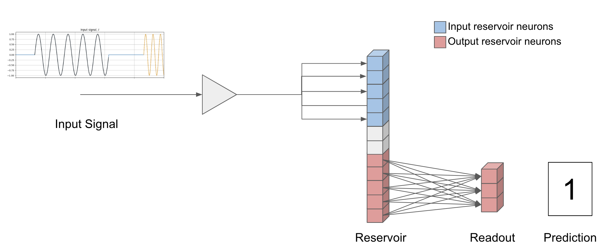
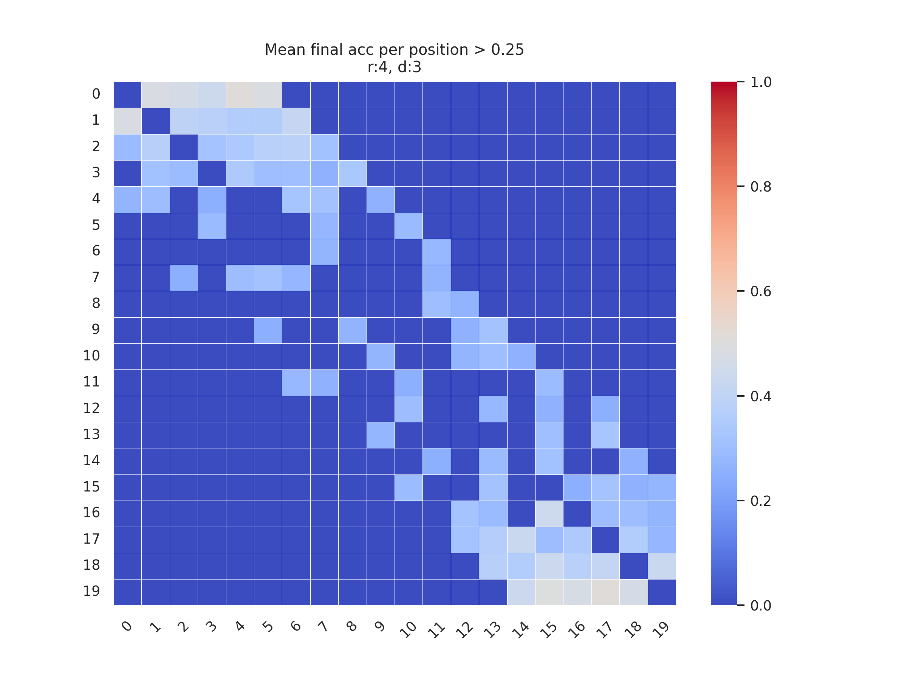

# Topological Analysis - Exp1

## Contents
- [Contents](#contents)
  - [The Signal](#the-signal)
- [The Network](#the-network)
  - [The Reservoir](#the-reservoir)
  - [The Readout](#the-readout)
- [The Training](#the-training)
  - [The Loss Computation](#the-loss-computation)
- [Experiment](#experiment)
- [Visualization](#visualization)
  - [Top n connections by performance](#top-n-connections-by-performance)
    - [Graph of the Top n connections by performance](#graph-of-the-top-n-connections-by-performance)
  - [Mean performance by shift wrt diagonal](#mean-performance-by-shift-wrt-diagonal)
- [Back to LSM Topological Analysis](#back-to-lsm-topological-analysis)

### The Signal
The signal on which the network was trained consists of a constant baseline and alternating fragments whose frequency can be one of two possible

## The Network



The neural network is a Liquid State Machine (LSM) \[Maas, 2002\], with the following characteristics.

### The Reservoir

* Total number of neurons: 20
* Number of input neurons: 10
* Number of output neurons: 10
* Weights values randomly assigned (Normal)
* Synaptic connections with decay
   * Randomly distributed (Normal)
   * decay function: $g[t+1] = q \cdot g[t]$, with $g$ synaptic gain (conductance) and $q \in [0, 1]$ decay rate.
   * decay rate: .25

### The Readout

Fully connected layer.
* Number of neurons equal to the number of categories to classify

## The Training

* Optimizer: Adam \[Kigma, 2014\]
* Loss based on CrossEntropy

At each training step the network receives a signal element.
The network subsequently completes an entire propagation step between the layers until a prediction is reached.  
A buffer of a specific size, sequentially collects a specific amount of network outputs.


Given:  
* [signal](#the-signal) $s[n] \in \mathbb{R} : \{s[0], .., s[N]\}$, a discrete time input, $T$ seconds long and with $r_s$ sampling rate;
* $y \in Y \subset \mathbb{N}$, with $Y: \{0, c_1, .., c_C\}$ and $y:\{y_0, ..., y_N\}$, being a vector of integer labels, containing labels equal to 1 + $C$ categories. Where ncategories is the number of categories to be classified, excluding the baseline category, corresponding to everything that is not such categories. In our case the signal baseline.
* a [Liquid State Machine](#the-network) [Maas, 2002], made by a Liquid Filter (reservoir) $R$, a Readout $f$. It is supposed to learn a mapping between $s$ and $y$, returning a $\hat{y}_i$. We'll refer to the whole of it as a $Z$.
* $\hat{y} \in Y$, $\hat{y}:\{\hat{y}_0, ..., \hat{y}_N\}$, vector of integer labels, returned by the LSM Readout, $f$. $\hat{y}=Z(s[n])$


At each time step, $n_i$, the network, $Z$, receives a $s[n_i]$ element which is processed in one step by the whole network, until it returns a $\hat{y_i}$. 

### The Loss Computation
At a specific step interval, $l_{scope}$ (250), the loss is calculated over the the whole buffer. Let's see the main stages of the process.

Given:
* a $L_{scope} \in \mathbb{N}, L_{scope}<N$ , loss scope. Step interval at which the loss is computed.

<!-- * a buffer $B_{y}$,  
$$ (\forall n_i \in [0, N]):  \\
\space\space\space\space \hat{y}_i=Z(s[n_i]) \\
B[n_i] \leftarrow \hat{y}_i
$$ -->

$\space\space\space\space L(\hat{y}[ni-L_{scope}, ni], y[ni-L_{scope}, ni]) ; \forall n_i \in L_{scope}$

TODO: ADD washout

```
{below, incomplete code to be continued}

s: signal
y: labels

FOR each ni from 0 to s_length - 1 DO:
  xi <- s[ni]
  yi <- y[ni]
  spk_prev = 
  ...
```

## Experiment
After researching the most important hyperparameters,
we chose a configuration to analyze.  
* reservoir_size: 20,
* radius: 4,
* degree in \{2, 3\}.

Comprehensive training was repeatedly launched and performance was collected.  

100 runs were performed for each change in (degree, radius).

The performance metrics chosen here is the average prediction accuracy in the last 10% portion of the signal, $acc_{10p}$.


## Visualization
Below we see a representation of the average performance obtained by connection position on the adjacency matrix.


<!-- Each graph was obtained by multiplying the binary adjacency matrix of each run by $acc_{10p}$ and finally averaging for each cell.




 -->


<!-- Here below we see reported the same values as in the graphs above, but filtered by $acc_{10p}$ > 0.25


 -->

### Top n connections by performance

Here below we see the top connections by mean performance


#### Graph of the Top n connections by performance

Below we see a graph rapresentation of the top neuron positions


### Mean performance by shift wrt diagonal


## Back to LSM Topological Analysis

[LSM-topological_analysis](./../../../docs/LSM-topological_analysis.md)
