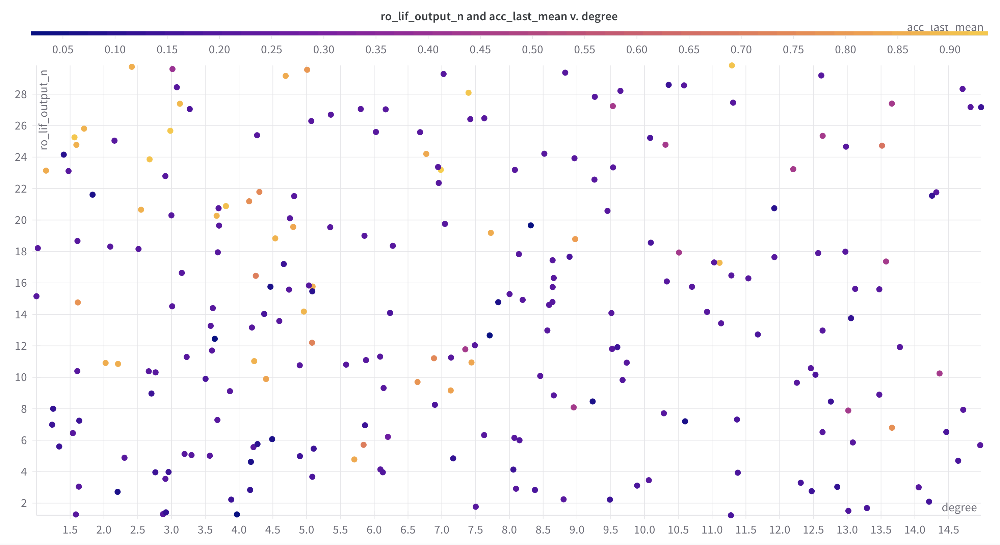
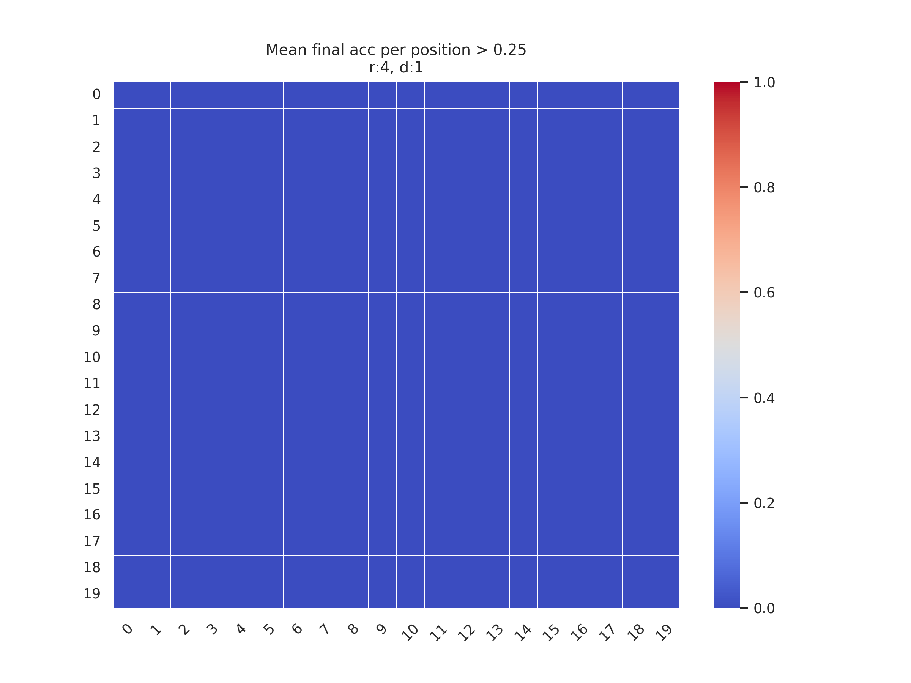
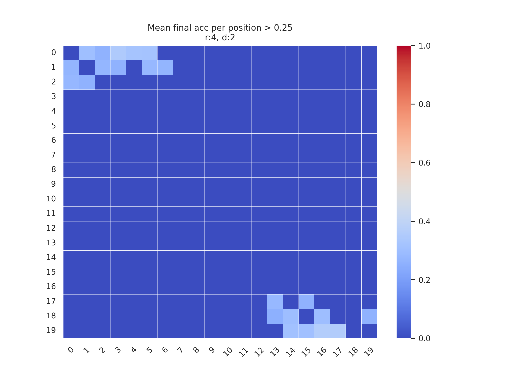
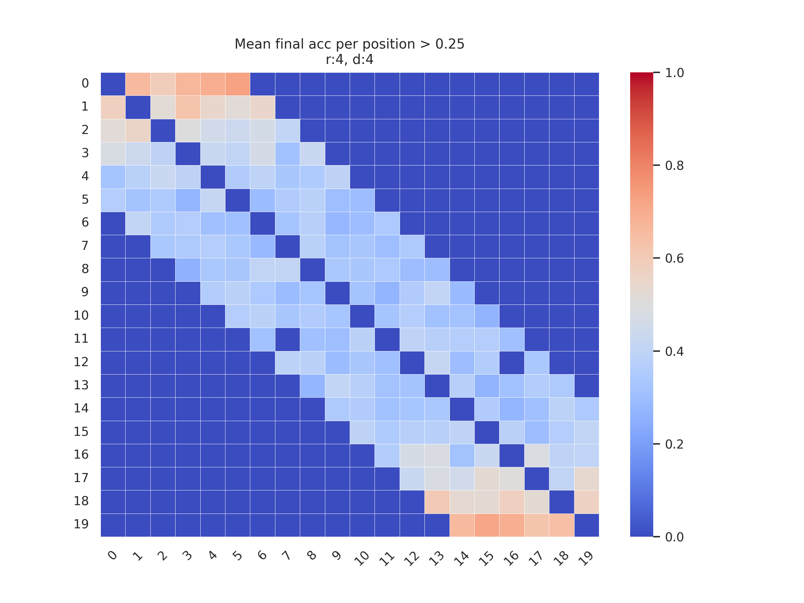
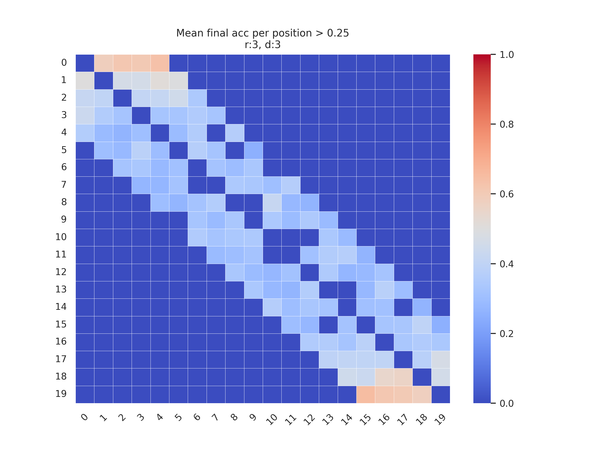
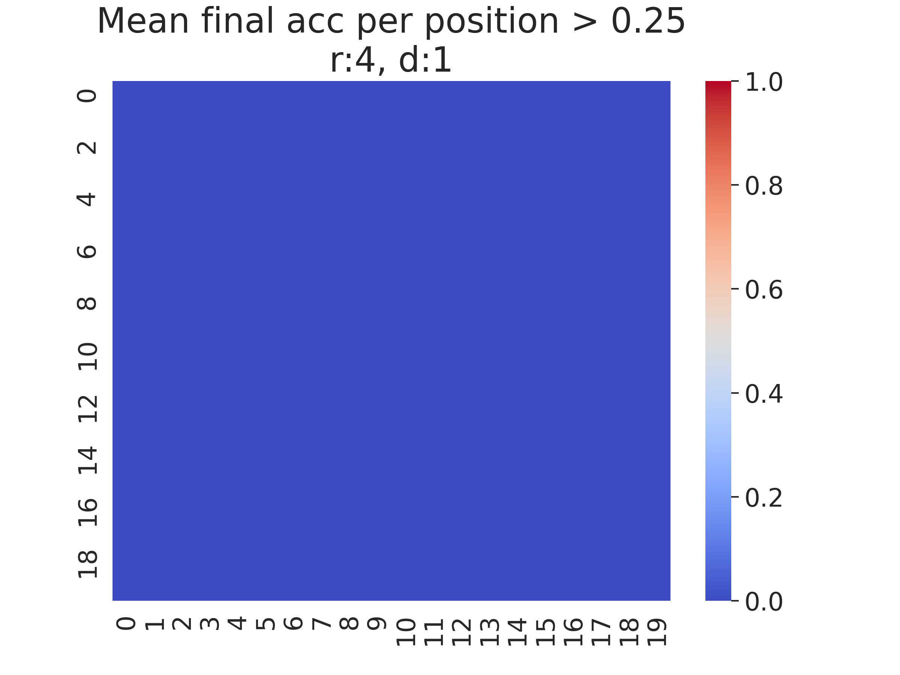
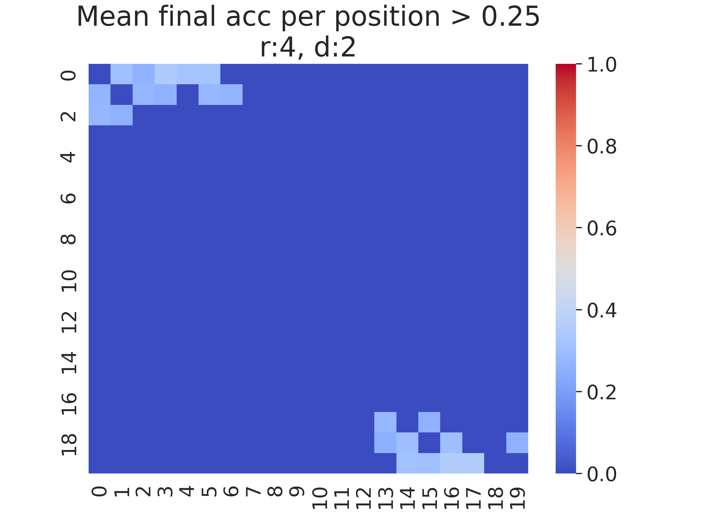
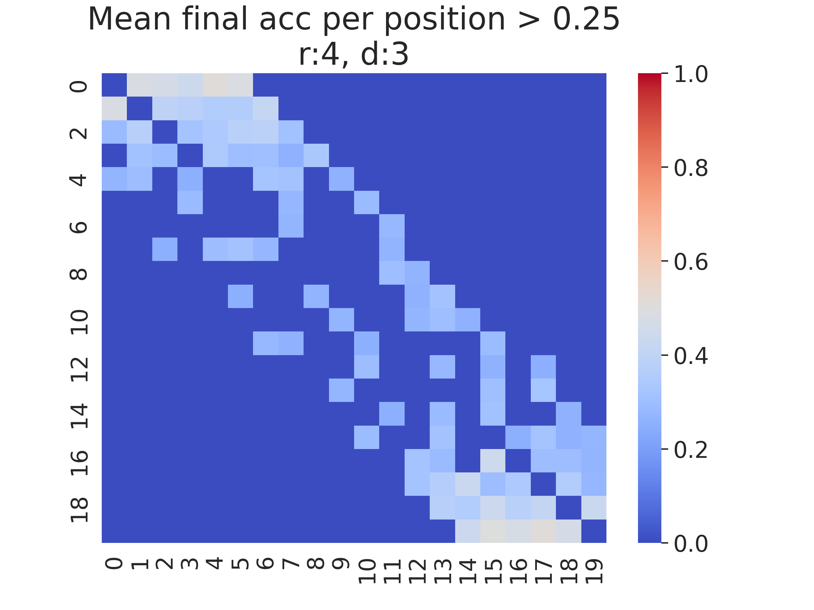
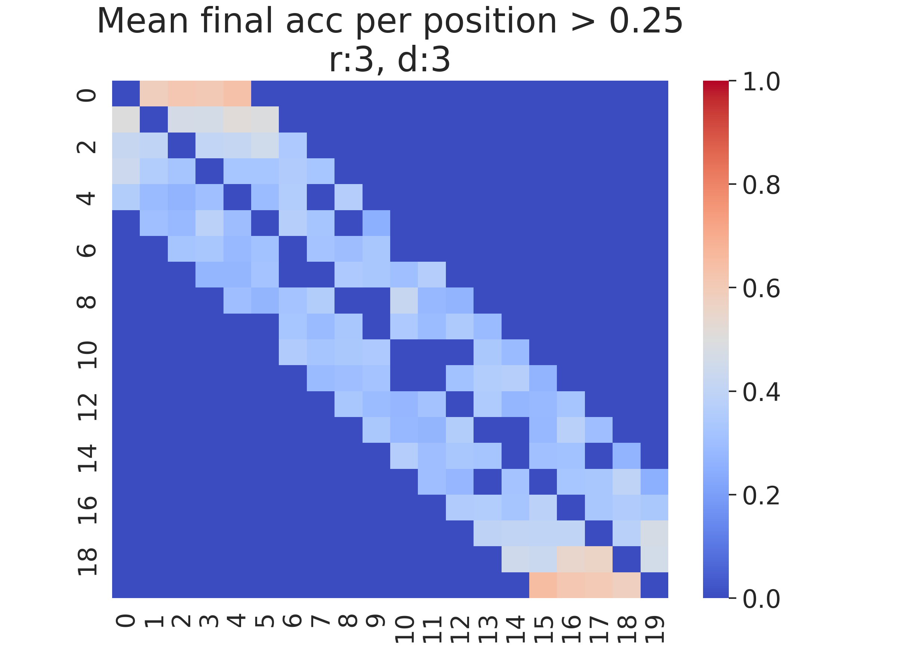
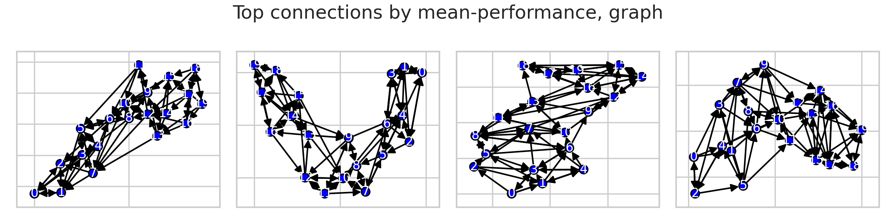

# Topological Analysis - Exp2

## Contents
- [Contents](#contents)
  - [The Signal](#the-signal)
- [The Network](#the-network)
  - [The Reservoir](#the-reservoir)
  - [The Readout](#the-readout)
- [Hyperparameter Optimization](#hyperparameter-optimization)
  - [First cycle](#first-cycle)
  - [Second cycle](#second-cycle)
- [The Training](#the-training)
  - [The Loss Computation](#the-loss-computation)
- [Experiment](#experiment)
- [Visualization](#visualization)
  - [Top n connections by performance](#top-n-connections-by-performance)
    - [Graph of the Top n connections by performance](#graph-of-the-top-n-connections-by-performance)
  - [Mean performance by shift wrt diagonal](#mean-performance-by-shift-wrt-diagonal)
- [Back to LSM Topological Analysis](#back-to-lsm-topological-analysis)

Topological analysis on quantized synapses.  
The following topological analysis is based on the [previous one](./topological-analysis-exp1.md), with some slight change.

### The Signal
The signal on which the network was trained consists of a constant baseline and alternating fragments whose frequency can be one of two possible

## The Network

The neural network is a Liquid State Machine (LSM) \[Maas, 2002\], with the following characteristics.

### The Reservoir

* Total number of neurons: 20
* Number of input neurons: 10
* Number of output neurons: 10
* Weights values randomly assigned (Normal)
* Synaptic connections with decay
   * Randomly distributed (Normal)
   * decay function: $g[t+1] = q \cdot g[t]$, with $g$ synaptic gain (conductance) and $q \in [0, 1]$ decay rate.
   * decay rate: .25
   * **Quantized** into 3 intervals, they can be one of: $\{0, 0.5, 1\}$

### The Readout

Fully connected layer.
* Number of neurons equal to the number of categories to classify

## Hyperparameter Optimization

Before starting with the experiment, it was necessary to optimize the parameters. This was done since this spiking architecture offers a very large hyperparameter space, and at the moment there is no known law that binds them correlated with performance; therefore, it is necessary to find an ideal working space from which to start. 
Weight and Biases was used for parameter optimization, with *random* search. 

The following picture depicts the approach we used

### First cycle
Below are some graphs that had decision value on the choice. 

Fig.1  

A scatter plot can be seen in Fig. 1, which shows: on the vertical axis the number of neurons output from the reservoir to the Readout, the output degree of neurons on the horizontal axis. The scatter plots are colored according to performance, the more they tend to light yellow the better the performance.
It can be seen that the best performance accumulates in the left half of the graph, that is, for output the green less than 8. It can be hypothesized that there is an inverse linear relationship between number of output neurons from reservoir and output degree. We also consider the large variance of the result due to the influence of other Hyper parameters as well as the inherent variability of the architecture.   

For these reasons we think it is appropriate to consider the following intervals for future experiments:
- degree: {2, 8}
- ro_lif_output_n: {7, 28}
- hypothesis (to be validated): ro_lif_output_n = 0.61 degree + 1.73

### Second cycle

A Bayesian Search criterion was chosen in this cycle. 
It can be seen from Fig.2 (below) that optimal hyperparameter intervals for performance emerge. 
We will perform the last optimization cycle in these intervals. 

Fig.2  

## The Training

* Optimizer: Adam \[Kigma, 2014\]
* Loss based on CrossEntropy

At each training step the network receives a signal element.
The network subsequently completes an entire propagation step between the layers until a prediction is reached.  
A buffer of a specific size, sequentially collects a specific amount of network outputs.

### The Loss Computation
At a specific step interval, $l_{scope}$ (250), the loss is calculated over the the whole buffer.

## Experiment
After researching the most important hyperparameters,
we chose a configuration to analyze.  
* reservoir_size: 20,
* radius: 4,
* degree in \{2, 3\}.

Comprehensive training was repeatedly launched and performance was collected.  

100 runs were performed for each change in (degree, radius).

The performance metrics chosen here is the average prediction accuracy in the last 10% portion of the signal, $acc_{10p}$.

## Visualization
Below we see a representation of the average performance obtained by connection position on the adjacency matrix.

<!-- Each graph was obtained by multiplying the binary adjacency matrix of each run by $acc_{10p}$ and finally averaging for each cell.

 -->

<!-- Here below we see reported the same values as in the graphs above, but filtered by $acc_{10p}$ > 0.25

 -->

### Top n connections by performance

Here below we see the top connections by mean performance

#### Graph of the Top n connections by performance

Below we see a graph rapresentation of the top neuron positions

### Mean performance by shift wrt diagonal

## Back to LSM Topological Analysis

[LSM-topological_analysis](./../../../docs/LSM-topological_analysis.md)
