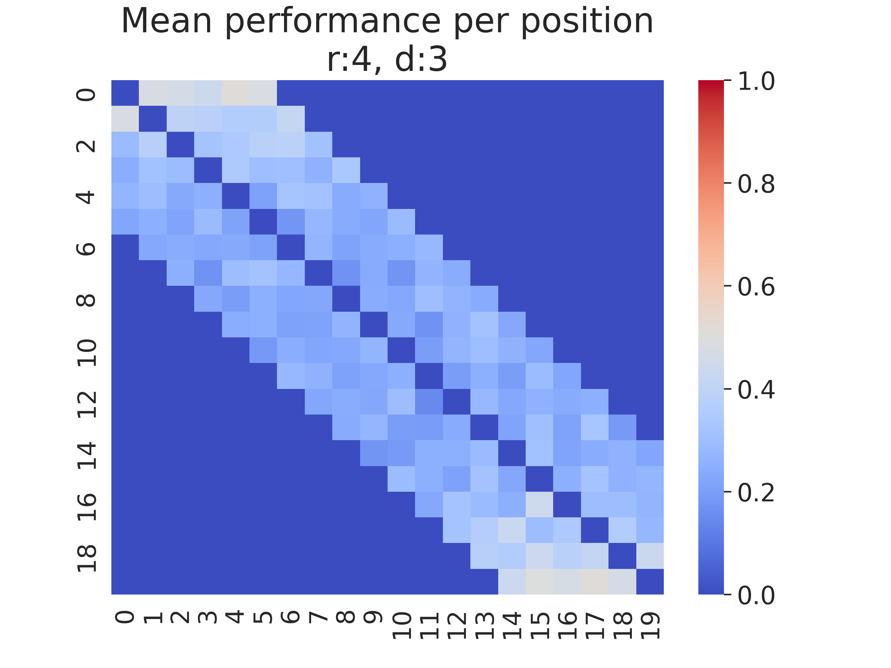
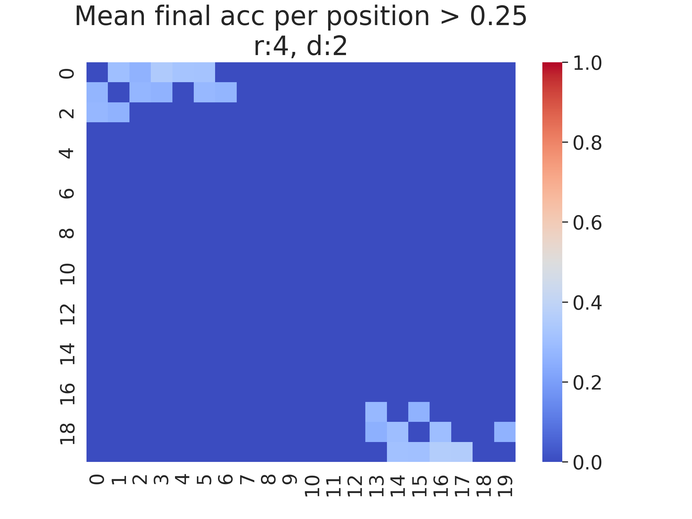
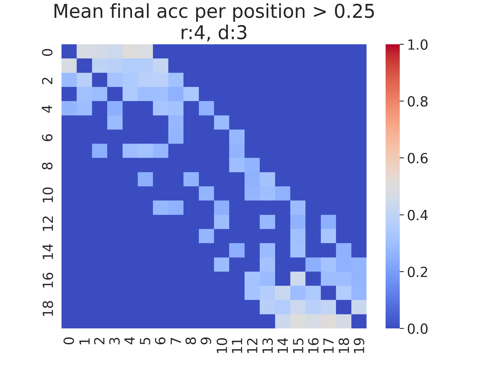

# Topological Analysis

### The signal
The signal on which the network was trained consists of a constant baseline and alternating fragments whose frequency can be one of two possible

## Experiment
After researching the most important hyperparameters,
we chose a configuration to analyze.  
* reservoir_size: 20,
* radius: 4,
* degree in \{2, 3\}.

Comprehensive training was repeatedly launched and performance was collected.  

100 runs were performed for each change in (degree, radius).

The performance metrics chosen here is the average prediction accuracy in the last 10% portion of the signal, $acc_{10p}$.

## Visualization
Below we see a representation of the average performance obtained by connection position on the adjacency matrix.

Each graph was obtained by multiplying the binary adjacency matrix of each run by $acc_{10p}$ and finally averaging for each cell.

Here below we see reported the same values as in the graphs above, but filtered by $acc_{10p}$ > 0.25

